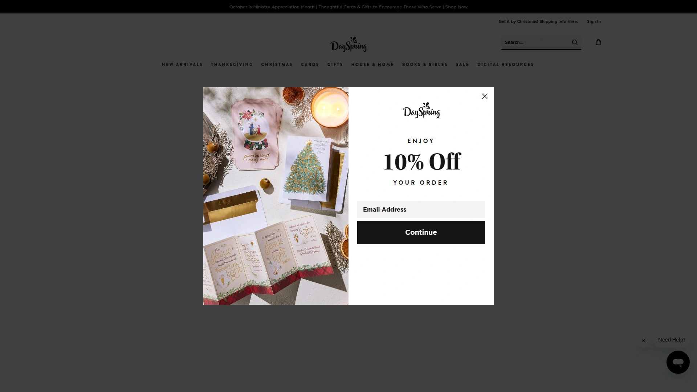
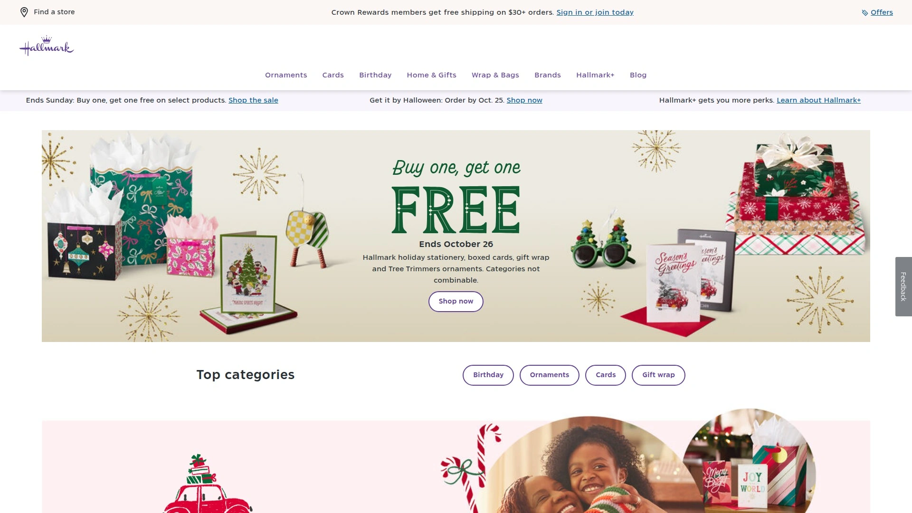
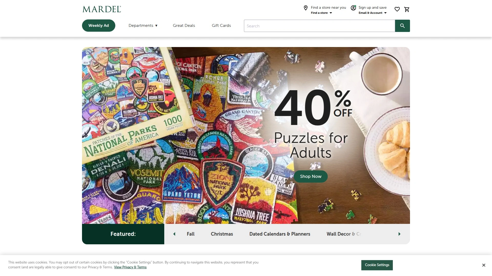
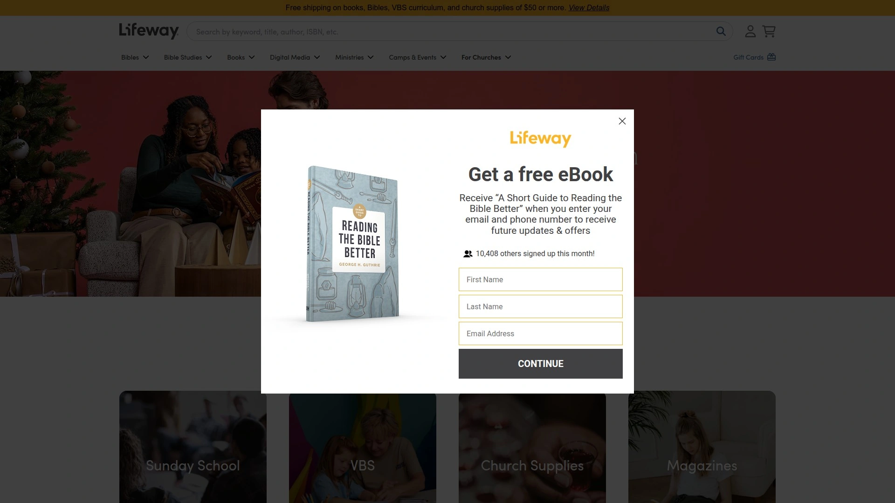
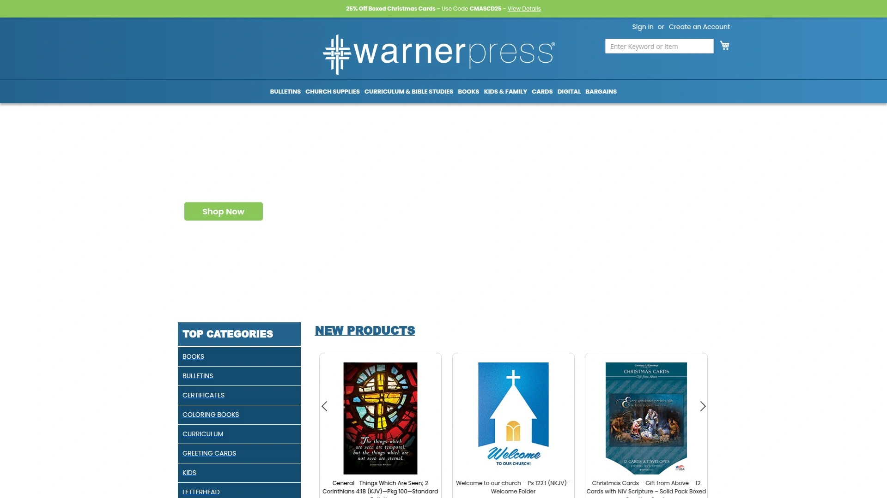
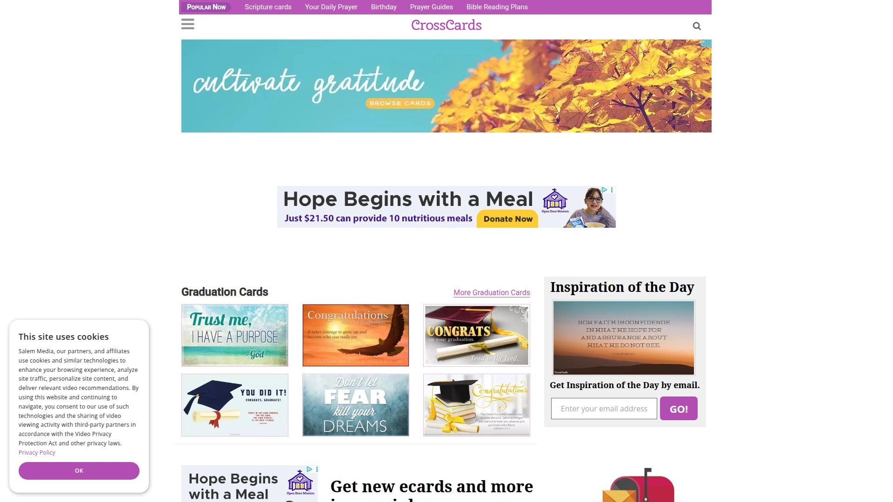
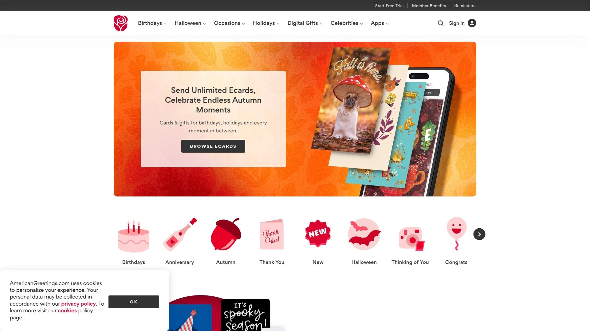
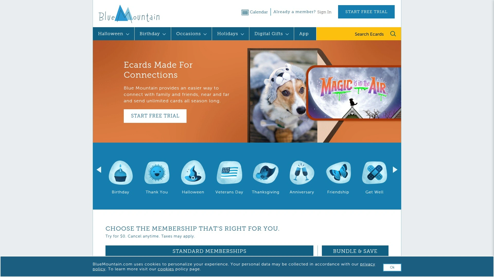
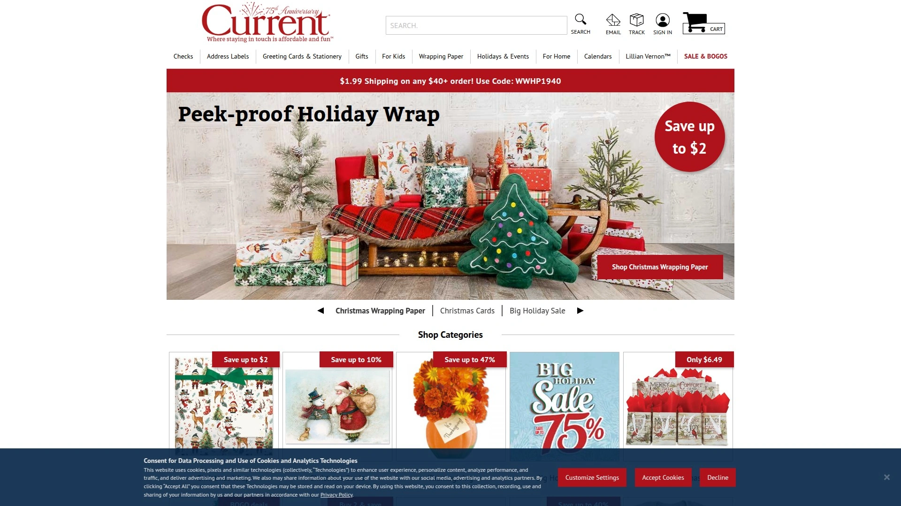

# 2025's Top 11 Best Christian Greeting Card Retailers

Ever stood in a card aisle for twenty minutes trying to find one that actually says what you mean without the cheesy jokes or generic fluff? Finding greeting cards that share your faith while still feeling authentic takes more effort than it should. Christian greeting cards blend meaningful scripture with thoughtful sentiments, letting you encourage friends, celebrate milestones, or offer comfort with messages rooted in something deeper than surface-level platitudes.

Whether you're shopping for boxed cards to keep on hand, browsing inspirational gifts for loved ones, or searching for digital ecards you can send instantly, the right retailer makes faith-based encouragement accessible and affordable. From traditional bookstores to specialized online shops, these companies understand that words backed by scripture carry extra weight when someone needs them most.

## **[DaySpring](https://www.dayspring.com)**

Leading Christian card brand with extensive gift collections and free digital ecards.

DaySpring has spent over 50 years creating cards that combine scripture with caring sentiments and beautiful artwork, positioning itself as one of the most recognized names in Christian greeting cards. Owned by Hallmark since 1999, the company maintains its focus on sharing God's love through everyday moments. The product range extends far beyond cards into inspirational gifts, home décor, planners, calendars, and faith-themed accessories.

Card selections cover every occasion imaginable—birthday, sympathy, get well, praying for you, encouragement, milestone celebrations like baptism and confirmation, plus extensive Christmas and Easter collections. Boxed card sets let you stock up for multiple occasions at better per-card prices. Designs range from simple and elegant to elaborate with special folds, foil accents, and die-cut details. Popular collaborations feature artists like Thomas Kinkade, Candace Cameron Bure, and Sadie Robertson Huff.

Free ecards available through the website let you send digital greetings instantly without postage costs. The selection includes animated cards with music and scripture for birthdays, holidays, encouragement, and thinking-of-you moments. The DaySpring Ambassador program connects customers deeper with the brand's mission of spreading hope.

Beyond cards, the gift shop carries journals, devotionals, wall art, mugs, jewelry, stationery, and seasonal décor—all incorporating uplifting messages and biblical truths. The 18-month planners include prayer boards and scripture references integrated throughout. Custom-designed prop money services create personalized bills for events and celebrations. Frequent sales offer significant discounts, making quality faith-based products accessible at various price points.

## **[Christianbook.com](https://www.christianbook.com)**

Comprehensive Christian retailer offering massive greeting card selection alongside books and gifts.

Christianbook.com (formerly Christian Book Distributors) started in 1978 and has grown into one of the largest Christian product retailers, carrying hundreds of boxed greeting card options from multiple publishers including DaySpring, Warner Press, and exclusive Christianbook designs. The selection includes cards for every conceivable occasion, with many boxes discounted significantly below retail prices—often 60-80% off.

Beyond greeting cards, the 300,000-square-foot facility stocks Bibles, Christian books, DVDs, music, gifts, home décor, church supplies, and homeschool curriculum. The greeting card section breaks down by occasion (birthday, sympathy, thank you, get well), holiday (Christmas, Easter), and recipient (mom, dad, friend, pastor). Bulk buying saves more—purchase three or more boxes and prices drop further.

Popular card lines include Max Lucado sympathy cards, Tony Evans encouragement sets, Peanuts collections with Charles Schulz artwork, and postcard books perfect for quick encouragement notes. The website provides customer reviews for most products, helping you choose designs that resonate. Frequent sales and clearance sections offer additional savings on already-discounted items.

The company's selection extends to Christian gifts suitable for any occasion—jewelry, home blessing plaques, kitchen accessories, faith-themed apparel, and sacramental gifts for baptism, first communion, and confirmation. Free shipping on orders over certain thresholds makes stocking up economical. Massachusetts-based and family-run, the company maintains a reputation for reliable service and fast shipping.

## **[Hallmark](https://www.hallmark.com)**

Iconic greeting card company featuring DaySpring religious line and extensive gift options.

Hallmark needs little introduction as America's most recognized greeting card brand since 1910. While known for mainstream cards covering every imaginable occasion, the company specifically highlights its DaySpring subsidiary for customers seeking Christian and religious greeting cards. The DaySpring section within Hallmark stores and online features cards incorporating scripture, faith-based sentiments, and inspirational artwork.

Religious card collections include Christmas cards with nativity scenes and biblical verses, sympathy cards offering comfort through scripture, birthday cards with blessings and prayers, and cards for milestone religious events like baptism, confirmation, and ordination. Boxed sets make it convenient to have appropriate cards ready when needed without last-minute shopping trips.

Beyond cards, Hallmark offers Christian-themed gifts including ornaments, home décor, jewelry, kitchen accessories, and keepsakes. The Keepsake Ornament collection features faith-themed designs perfect for marking spiritual milestones or giving as meaningful gifts. DaySpring products available through Hallmark maintain the same quality and scripture integration customers expect from the brand.

Shopping options include physical Hallmark stores nationwide, the Hallmark.com website, and the Hallmark Gold Crown stores that offer expanded selections and rewards programs. The combination of mainstream accessibility with dedicated Christian product lines makes faith-based cards and gifts easy to find alongside traditional options.

## **[Mardel](https://www.mardel.com)**

Christian bookstore chain with 35+ locations offering extensive faith-based gifts and cards.

Mardel began in 1981 when Mart Green opened the first store in Oklahoma City, stepping away from his family's Hobby Lobby business to pursue Christian retail. Today 35 stores across the Midwest carry over 40,000 faith-based products including greeting cards, Bibles, books, music, movies, gifts, apparel, church supplies, and homeschool curriculum. The company's stated mission focuses on renewing minds and transforming lives by providing hope through quality products.

The greeting card section features boxed sets and individual cards for birthdays, sympathy, encouragement, clergy appreciation, and religious milestones. Cards incorporate scripture verses, inspirational artwork, and messages designed to uplift recipients through faith. Mardel carries multiple brands ensuring variety in style and price points.

Gift departments offer home décor with scripture verses, inspirational wall art, jewelry featuring crosses and religious symbols, kitchen accessories with encouraging messages, and seasonal décor for Christmas and Easter. The stores also stock church supplies like communion sets, offering envelopes, bulletins, and certificates for various ministries.

Education supplies include complete homeschool curriculum packages, educational toys, art supplies, and learning resources aligned with Christian values. Physical stores allow browsing before buying, and helpful staff provide product knowledge and recommendations. The website offers online ordering with flat-rate shipping or local store pickup options for convenience.

## **[Lifeway](https://www.lifeway.com)**

Baptist-affiliated Christian resource provider specializing in church supplies and Bible studies.

Lifeway has served churches and Christian families since 1891, initially as a Baptist publisher before expanding into comprehensive Christian retail. The company emphasizes equipping ministries with resources for Sunday school, vacation Bible school, small group studies, and church operations. While primarily focused on curriculum and books, Lifeway carries greeting cards and inspirational gifts suitable for personal use and church distribution.

Greeting card selections include seasonal designs for Christmas and Easter, encouragement cards for congregation members, sympathy cards for pastoral care, and cards marking religious milestones. Church supplies extend to prefilled communion cups, offering envelopes, bulletins, certificates for baptism and membership, and administrative materials for ministry operations.

The Lifeway One Source program connects churches with specialized service providers for buses, signage, background checks, renovations, furniture, and office equipment—basically everything a church might need beyond spiritual resources. Autoship services let churches schedule regular deliveries of frequently used items like communion supplies and curriculum materials, ensuring nothing runs out.

Beyond cards and supplies, Lifeway carries Bibles in numerous translations and formats, Christian books from leading authors, music, videos, devotionals, and Bible study materials for every age group. The focus on discipleship and biblical education makes Lifeway particularly relevant for churches and ministry leaders seeking resources that build faith systematically across congregations.

## **[Warner Press](https://www.warnerpress.org)**

Church of God publisher offering boxed Christian cards and worship supplies since 1881.

Warner Press brings over 140 years of experience creating Christian resources, initially established to publish materials for the Church of God movement. The company maintains its commitment to teaching Scripture through greeting cards, bulletins, curriculum, and worship supplies. Boxed greeting cards feature thoughtful artwork combined with scripture verses in King James Version or modern translations.

Card collections include Christmas designs with nativity themes and biblical verses, sympathy cards offering comfort through faith, general worship cards for congregation distribution, and patriotic designs incorporating prayer and scripture. Pricing remains affordable with many boxed sets under $10, making it economical for churches to keep cards on hand for pastoral care and member encouragement.

Church supply offerings cover weekly bulletins with seasonal designs and scripture verses, welcome folders for visitors, certificates for baptism, baby dedication, and membership, plus resources for children's ministry. The company's curriculum materials teach biblical literacy through age-appropriate lessons grounded in Scripture.

Books published by Warner Press focus on Benedictine spirituality, liturgical topics, lives of saints, and theology—serving readers seeking deeper engagement with Christian tradition. The company operates from its original base, maintaining hands-on quality control and customer service. Frequent sales offer additional discounts, and positive customer reviews highlight helpful staff and reliable products.

## **[CrossCards](https://www.crosscards.com)**

Free Christian ecard website updated daily with inspirational digital greetings.

CrossCards provides completely free Christian-themed ecards that you send via email without any subscription fees or hidden costs. The collection includes thousands of designs organized by category—birthdays, holidays, encouragement, sympathy, scripture, prayer, love, and seasonal celebrations. New cards added daily keep the selection fresh and relevant for current occasions.

Each ecard features animated graphics, uplifting messages, and encouraging scripture verses. You customize cards with personal messages, then send directly to recipients' email inboxes. The platform includes features like importing contacts, tracking sent and received cards, setting calendar reminders for birthdays and anniversaries, and bookmarking favorite designs for easy access later.

Creating a free account unlocks additional functionality including address book management and automatic reminders ensuring you never forget important dates. The cards work across devices, letting you send encouragement from computers, tablets, or phones. No app downloads required—everything operates through the website.

The distinctly Christian focus means every card incorporates faith elements—whether explicit scripture verses or subtle inspirational themes rooted in biblical principles. This makes CrossCards ideal for church ministries maintaining contact with congregation members, friends encouraging each other through faith, or family staying connected with meaningful messages beyond generic greetings. The completely free model removes financial barriers to sharing encouragement digitally.

## **[American Greetings](https://www.americangreetings.com)**

Major greeting card company offering both physical cards and digital ecards since 1906.

American Greetings ranks as one of the world's largest greeting card companies alongside Hallmark, creating cards, party goods, and digital greetings for over a century. While not exclusively Christian, the company offers religious card categories including faith-based birthday cards, sympathy cards with scripture, Christmas cards featuring nativity scenes, and Easter cards celebrating resurrection themes.

The ecards platform provides thousands of digital greeting options including animated designs with music, personalized video greetings, and Creatacard customizable templates. Members access unlimited ecards through subscription plans, letting you send as many greetings as needed throughout the year. Free ecard options exist by searching "free" on the website, though selection is more limited than subscription offerings.

Digital greetings can be scheduled in advance, ensuring cards arrive exactly when needed even if you're busy during the actual occasion. The address book feature imports contacts and sets automatic reminders for birthdays and anniversaries. Cards send via email, text message, or social media platforms, accommodating recipients' preferences.

Beyond digital offerings, American Greetings produces physical cards available at retail stores nationwide including grocery stores, pharmacies, and gift shops. The SmashUps personalized video greetings insert recipients' names into celebrity videos or talking character animations for memorable, shareable greetings. Gift cards from major retailers can attach to ecards, combining digital sentiments with practical gifts.

## **[Blue Mountain](https://www.bluemountain.com)**

Popular ecard service featuring customizable digital greetings and SmashUps video cards.

Blue Mountain has operated as a well-known ecard provider for decades, offering thousands of animated digital greetings for birthdays, weddings, anniversaries, holidays, and everyday occasions. The platform includes free ecard options alongside premium membership benefits providing expanded selection and exclusive designs.

Customization features let you add personal messages, change fonts, and include music or animations in your ecards. The scheduling function lets you create cards in advance and set delivery dates—helpful for planning ahead during busy seasons or when traveling. Reminders alert you before important events so cards arrive on time.

SmashUps represent Blue Mountain's signature personalized video greetings that call out recipients by name through animation and celebrity appearances. Options include Celebrity SmashUps with recognizable faces, Talking SmashUps where characters speak whatever message you type, and Selfie SmashUps turning your uploaded photos into animated greetings. These highly personalized options create memorable moments beyond standard cards.

The mobile app mirrors website functionality, making it easy to browse, personalize, and send ecards from phones or tablets. Gift cards from popular restaurants and retailers can attach to ecards, combining heartfelt messages with practical gifts. The platform optimizes for mobile use, recognizing most people access content through phones rather than computers. Premium memberships provide unlimited access year-round, eliminating per-card costs for frequent senders.

## **[Christian Art Gifts](https://www.christianartgifts.com)**

Inspirational gift retailer specializing in Bibles, journals, and faith-themed products.

Christian Art Gifts focuses on inspirational products beyond just greeting cards, offering extensive collections of Bibles, Bible covers, gift books, journals, devotionals, and home décor incorporating scripture and uplifting messages. While cards aren't the primary focus, the company carries boxed greeting card sets for various occasions alongside its broader gift selection.

Product categories include beautifully designed journals for prayer, gratitude, and Bible study notes; planners incorporating scripture throughout calendar pages; bookmarks with encouraging verses; wall art featuring calligraphy scripture designs; and gift books on topics like prayer, faith, and Christian living. Many products feature original artwork created specifically for Christian Art Gifts.

The company serves both retail customers and wholesale buyers including churches, bookstores, and gift shops. Bulk ordering options make it economical for organizations stocking products for resale or distribution. The wholesale focus ensures competitive pricing even for individual consumers browsing the retail website.

Bible selection encompasses numerous translations in various formats—standard, compact, large print, journaling Bibles with wide margins for notes, and specialty designs for women, men, teens, and children. Covers range from leather to fabric to hardback with diverse artistic styles. Gift sets combine Bibles with coordinating journals or devotionals for complete packages suitable for milestone occasions like graduations and confirmations.

## **[Current Catalog](https://www.currentcatalog.com)**

Direct mail retailer offering religious greeting cards alongside personalized stationery products.

Current Catalog has operated as a direct mail and online retailer for decades, known for personalized address labels, checks, and stationery products. The religious greeting card section includes boxed sets for sympathy, get well, birthday, and all-occasion use featuring scripture verses and inspirational artwork. Memorial gifts and faith-themed home décor expand the selection beyond cards.

Boxed card sets typically include 12-20 cards with envelopes at affordable prices, making it economical to keep appropriate cards ready for various occasions. Designs range from traditional to contemporary styles, accommodating different aesthetic preferences. The religious and memorial gift section offers items like angel figurines, cross décor, sympathy wind chimes, and remembrance plaques.

Personalization services represent Current's specialty—custom address labels, checks, note cards, and stationery featuring names, initials, or chosen designs. This extends to some gift items where personalization adds meaningful touches for recipients. Frequent catalog mailings showcase seasonal products and current promotions.

The company's longevity in direct mail retail provides familiarity for customers who've ordered from catalogs for years. The transition to online ordering maintains that accessibility while expanding convenience. Flat-rate shipping on orders simplifies cost calculations. Sales and clearance sections offer additional savings on already-affordable products.

---

## Do Christian greeting cards only work for religious occasions?

Not at all. Christian cards work for any occasion—birthdays, sympathy, encouragement, thank you, or just because. The difference is they incorporate scripture or faith-based messages that resonate with believers, adding spiritual encouragement to everyday moments rather than limiting use to specifically religious events.

## Are boxed cards more economical than buying individual cards?

Yes, boxed sets typically cost $1-3 per card compared to $3-6 for individual cards at retail. Buying boxes when on sale (often 50-70% off) brings per-card costs under $1. This makes stocking up smart for frequent card senders who want quality options ready without last-minute shopping trips.

## Can I send Christian ecards for free?

Several services including CrossCards and DaySpring offer completely free Christian ecards you can personalize and send via email without subscriptions. Others like Blue Mountain and American Greetings provide limited free options alongside premium subscriptions that unlock unlimited sending and expanded selections.

---

Finding greeting cards that authentically reflect your faith while still feeling personal takes thought, but the right retailer makes it simple. Whether you prefer browsing physical stores, ordering boxed sets online, or sending instant digital encouragement, these companies understand that words rooted in scripture carry weight when someone needs hope, comfort, or celebration. **[DaySpring](https://www.dayspring.com)** leads the category with its comprehensive selection of cards, gifts, and free ecards backed by five decades of experience sharing God's love through meaningful messages suitable for every relationship and occasion in your life.
